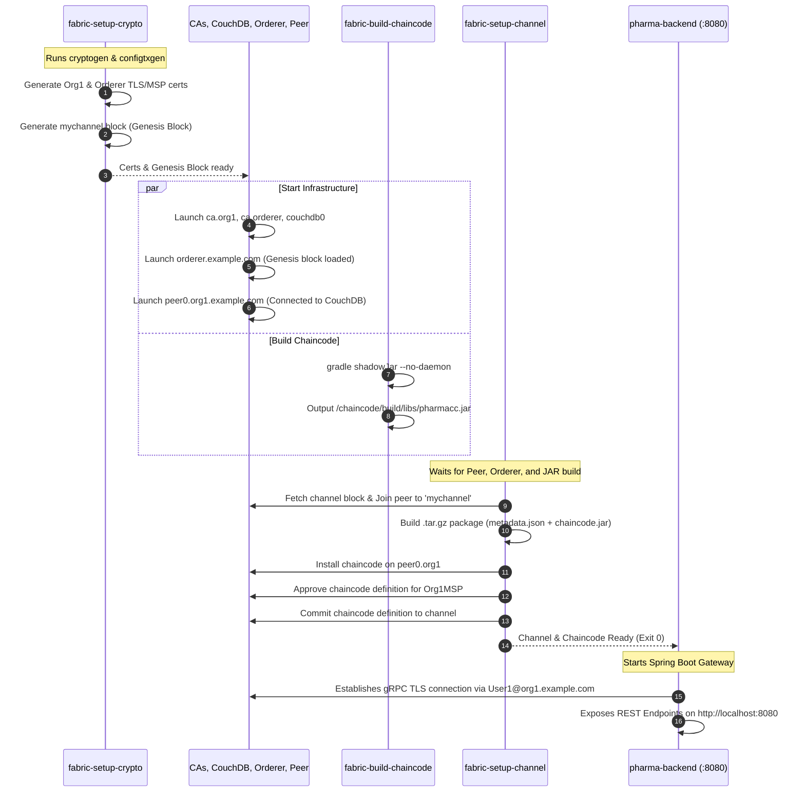
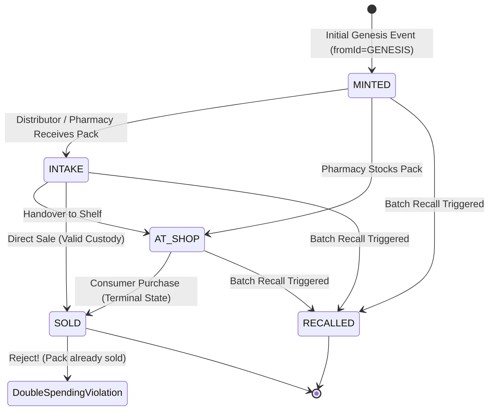
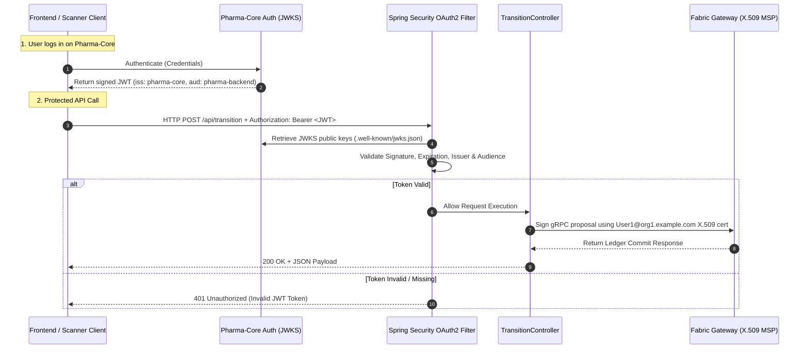
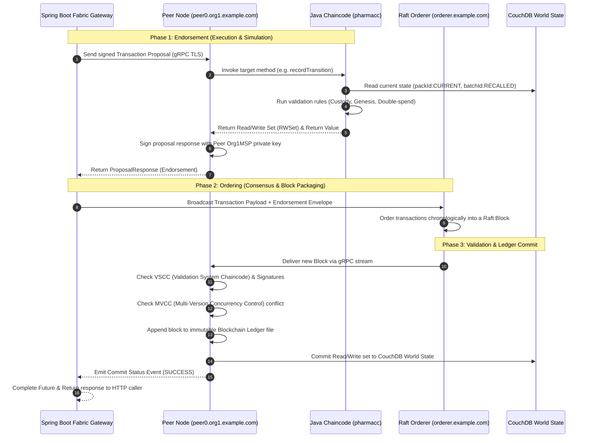
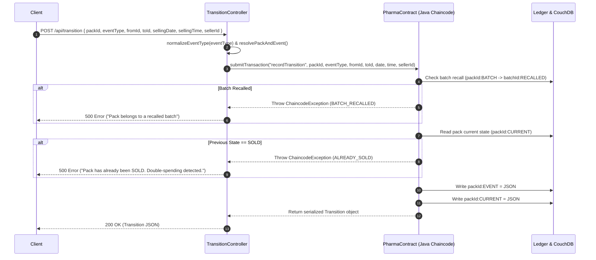
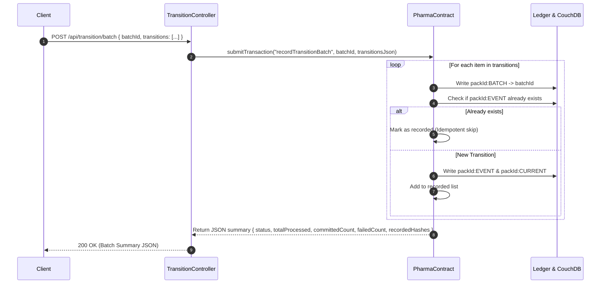
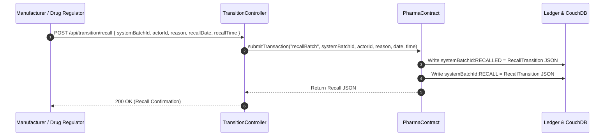
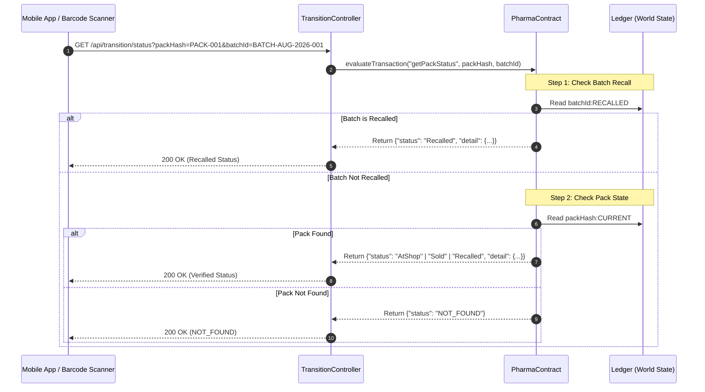
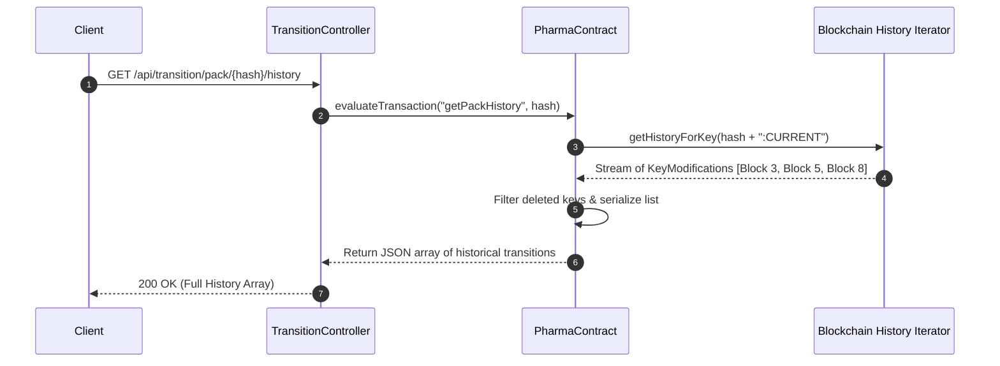

# PharmaChain: Architecture, Consensus & Complete API Flow Guide

This document provides a comprehensive, end-to-end breakdown of the **PharmaChain Blockchain Microservice**. It details the system architecture, container topology, Hyperledger Fabric consensus pipeline, cryptographic setup, smart contract state machine, and **visual Mermaid sequence flow diagrams for every API endpoint**.

---

## 📑 Table of Contents

1. [Executive Overview & Problem Statement](#1-executive-overview--problem-statement)
2. [End-to-End System Architecture](#2-end-to-end-system-architecture)
3. [Container Topology & Startup Sequence](#3-container-topology--startup-sequence)
4. [Smart Contract State Machine & Rules Engine](#4-smart-contract-state-machine--rules-engine)
5. [Security & Authentication Flow](#5-security--authentication-flow)
6. [Hyperledger Fabric Transaction Lifecycle (Consensus Flow)](#6-hyperledger-fabric-transaction-lifecycle-consensus-flow)
7. [Comprehensive API Reference & Sequence Diagrams](#7-comprehensive-api-reference--sequence-diagrams)
   - [7.1 Record Single Transition (`POST /api/transition`)](#71-record-single-transition-post-apitransition)
   - [7.2 Record Batch Transitions (`POST /api/transition/batch`)](#72-record-batch-transitions-post-apitransitionbatch)
   - [7.3 Recall Medicine Batch (`POST /api/transition/recall`)](#73-recall-medicine-batch-post-apitransitionrecall)
   - [7.4 Evaluate Pack Status with Recall Priority (`GET /api/transition/status`)](#74-evaluate-pack-status-with-recall-priority-get-apitransitionstatus)
   - [7.5 Get Current Pack State (`GET /api/transition/pack/{hash}/current`)](#75-get-current-pack-state-get-apitransitionpackhashcurrent)
   - [7.6 Get Immutable Pack History (`GET /api/transition/pack/{hash}/history`)](#76-get-immutable-pack-history-get-apitransitionpackhashhistory)
   - [7.7 Query Specific Transition by Hash (`GET /api/transition/{hash}`)](#77-query-specific-transition-by-hash-get-apitransitionhash)
   - [7.8 Rich CouchDB Selector Query (`GET /api/transition`)](#78-rich-couchdb-selector-query-get-apitransition)
   - [7.9 Actuator Health Check (`GET /actuator/health`)](#79-actuator-health-check-get-actuatorhealth)
8. [Storage & Ledger Key Schema](#8-storage--ledger-key-schema)
9. [Operational Cheat Sheet (Docker Commands)](#9-operational-cheat-sheet-docker-commands)

---

## 1. Executive Overview & Problem Statement

PharmaChain solves pharmaceutical counterfeiting, gray-market diversion, front-running, and recall latency by establishing an **immutable, distributed custody ledger**.

### Key Value Propositions
* **Serial-Level Provenance**: Every medicine pack is tracked from creation (`MINTED`), custody handover (`INTAKE` / `AT_SHOP`), to final consumer purchase (`SOLD`).
* **Double-Spending & Anti-Clone Shield**: A medicine unit cannot be sold twice or split into duplicate streams. Once marked `SOLD`, the ledger permanently locks the unit.
* **Front-Running Prevention**: A retailer cannot register a sale unless the unit was previously recorded as received (`AT_SHOP` / `INTAKE`).
* **Instant Batch Recalls**: If a batch is compromised (e.g. temperature excursion or contamination), a single recall transaction immediately flags every unit belonging to that batch across the entire supply chain.

---

## 2. End-to-End System Architecture

```mermaid
graph TB
    subgraph "External Clients & Gateway Ecosystem"
        Client["Mobile App / Web Dashboard / Barcode Scanner"]
        PharmaCore["Pharma-Core Auth Server (JWKS)"]
    end

    subgraph "PharmaChain Docker Compose Infrastructure"
        subgraph "Spring Boot REST Gateway (:8080)"
            SecFilter["Spring Security (OAuth2 / JWT)"]
            Controller["TransitionController"]
            FabGateway["Fabric Java SDK Gateway Client"]
        end

        subgraph "Hyperledger Fabric Network (:pharma-fabric)"
            Peer["peer0.org1.example.com (:7051, :7052)<br/>Endorser & Ledger Validator"]
            CouchDB["couchdb0 (:5984)<br/>Rich Query State Database"]
            Orderer["orderer.example.com (:7050)<br/>Raft Ordering Service"]
            CAOrg1["ca.org1.example.com (:7054)"]
            CAOrderer["ca.orderer.example.com (:9054)"]
            CC["pharmacc.jar (Chaincode)<br/>Java Contract Interface"]
        end
    end

    Client -->|1. HTTPS Request + Bearer JWT| SecFilter
    SecFilter -.->|Fetch & Validate Keys| PharmaCore
    SecFilter --> Controller
    Controller --> FabGateway
    FabGateway -->|2. gRPC + mutual TLS (Proposal)| Peer
    Peer <-->|Read / Write World State| CouchDB
    Peer -->|Execute Java Smart Contract| CC
    FabGateway -->|3. Broadcast Endorsed Tx| Orderer
    Orderer -->|4. Deliver Block with Transactions| Peer
```

---

## 3. Container Topology & Startup Sequence

When you execute `docker compose up --build -d`, services initialize in a strictly governed topological order:



---

## 4. Smart Contract State Machine & Rules Engine

The Java smart contract (`PharmaContract.java`) governs all transitions with the following state machine:



### Smart Contract Invariants
1. **Genesis Enforcement**: A pack *must* start with `MINTED` (or `MFG`). No item can jump directly to `INTAKE` or `SOLD`.
2. **Anti-Double-Spend**: Once a pack reaches `SOLD`, any subsequent transaction on that pack throws `ALREADY_SOLD`.
3. **Custody Verification**: In `SOLD` events, `fromId` must match the current owner recorded in `toId` of the preceding `AT_SHOP`/`INTAKE` event.
4. **Batch Recall Precedence**: Whenever any operation or query touches a pack, the chaincode queries `batchId:RECALLED`. If present, the status is immediately locked as **Recalled**.

---

## 5. Security & Authentication Flow



---

## 6. Hyperledger Fabric Transaction Lifecycle (Consensus Flow)

Every write API (`POST /api/transition`, `POST /api/transition/batch`, `POST /api/transition/recall`) executes through Hyperledger Fabric's **Execute-Order-Validate** consensus model:



---

## 7. Comprehensive API Reference & Sequence Diagrams

---

### 7.1 Record Single Transition (`POST /api/transition`)

Records a single lifecycle transition for a specific medicine unit pack.



#### Request Payload
```json
POST /api/transition
Authorization: Bearer <JWT>
Content-Type: application/json

{
  "packId": "PACK-9921-X8",
  "eventType": "MINTED",
  "fromId": "GENESIS",
  "toId": "MFR_CIPLA_01",
  "sellingDate": "20260825",
  "sellingTime": "14:30:00",
  "sellerId": "PLANT_A_SUPERVISOR"
}
```

#### Success Response (`200 OK`)
```json
{
  "packId": "PACK-9921-X8",
  "eventType": "MINTED",
  "hash": "PACK-9921-X8:MINTED",
  "fromId": "GENESIS",
  "toId": "MFR_CIPLA_01",
  "sellingDate": "20260825",
  "sellingTime": "14:30:00",
  "sellerId": "PLANT_A_SUPERVISOR"
}
```

---

### 7.2 Record Batch Transitions (`POST /api/transition/batch`)

Writes multiple unit transitions atomically in a single block with built-in idempotency.



#### Request Payload
```json
POST /api/transition/batch
Authorization: Bearer <JWT>
Content-Type: application/json

{
  "batchId": "BATCH-AUG-2026-001",
  "transitions": [
    {
      "packId": "PACK-001",
      "eventType": "MINTED",
      "fromId": "GENESIS",
      "toId": "MFR_01",
      "sellingDate": "20260825",
      "sellingTime": "10:00:00",
      "sellerId": "MFR_LINE_1"
    },
    {
      "packId": "PACK-002",
      "eventType": "MINTED",
      "fromId": "GENESIS",
      "toId": "MFR_01",
      "sellingDate": "20260825",
      "sellingTime": "10:00:00",
      "sellerId": "MFR_LINE_1"
    }
  ]
}
```

#### Success Response (`200 OK`)
```json
{
  "status": "success",
  "totalProcessed": 2,
  "committedCount": 2,
  "failedCount": 0,
  "recordedHashes": [
    "PACK-001",
    "PACK-002"
  ]
}
```

---

### 7.3 Recall Medicine Batch (`POST /api/transition/recall`)

Instantly invalidates an entire batch across the entire supply chain.



#### Request Payload
```json
POST /api/transition/recall
Authorization: Bearer <JWT>
Content-Type: application/json

{
  "systemBatchId": "BATCH-AUG-2026-001",
  "actorId": "REGULATOR_FDA_IN",
  "reason": "Critical temperature excursion during transit (>25C)",
  "recallDate": "20260825",
  "recallTime": "15:45:00"
}
```

#### Success Response (`200 OK`)
```json
{
  "packId": "BATCH-AUG-2026-001",
  "eventType": "RECALLED",
  "hash": "BATCH-AUG-2026-001:RECALLED",
  "fromId": "REGULATOR_FDA_IN",
  "toId": "RECALLED",
  "sellingDate": "20260825",
  "sellingTime": "15:45:00",
  "sellerId": "Critical temperature excursion during transit (>25C)"
}
```

---

### 7.4 Evaluate Pack Status with Recall Priority (`GET /api/transition/status`)

Consumer / Pharmacist verification endpoint. Queries state without submitting an on-chain transaction.



#### Request
```http
GET /api/transition/status?packHash=PACK-001&batchId=BATCH-AUG-2026-001
Authorization: Bearer <JWT>
```

#### Response Scenarios

* **Active Valid Pack in Shop:**
```json
{
  "status": "AtShop",
  "detail": {
    "packId": "PACK-001",
    "eventType": "AT_SHOP",
    "hash": "PACK-001:AT_SHOP",
    "fromId": "DISTRIBUTOR_A",
    "toId": "APOLLO_PHARMACY_08",
    "sellingDate": "20260825",
    "sellingTime": "11:20:00",
    "sellerId": "LOGISTICS_DRIVER_4"
  }
}
```

* **Recalled Batch:**
```json
{
  "status": "Recalled",
  "detail": {
    "packId": "BATCH-AUG-2026-001",
    "eventType": "RECALLED",
    "hash": "BATCH-AUG-2026-001:RECALLED",
    "fromId": "REGULATOR_FDA_IN",
    "toId": "RECALLED",
    "sellingDate": "20260825",
    "sellingTime": "15:45:00",
    "sellerId": "Critical temperature excursion during transit (>25C)"
  }
}
```

* **Unregistered Counterfeit Pack:**
```json
{
  "status": "NOT_FOUND"
}
```

---

### 7.5 Get Current Pack State (`GET /api/transition/pack/{hash}/current`)

Retrieves the current pointer state object of a medicine pack.

```http
GET /api/transition/pack/PACK-9921-X8/current
Authorization: Bearer <JWT>
```

#### Success Response (`200 OK`)
```json
{
  "packId": "PACK-9921-X8",
  "eventType": "AT_SHOP",
  "hash": "PACK-9921-X8:AT_SHOP",
  "fromId": "DISTRIBUTOR_DELHI",
  "toId": "MEDPLUS_STORE_101",
  "sellingDate": "20260825",
  "sellingTime": "12:00:00",
  "sellerId": "DELIVERY_AGENT_01"
}
```

---

### 7.6 Get Immutable Pack History (`GET /api/transition/pack/{hash}/history`)

Retrieves the complete, tamper-proof chronological audit trail directly from the blockchain block history (`ctx.getStub().getHistoryForKey()`).



#### Request
```http
GET /api/transition/pack/PACK-9921-X8/history
Authorization: Bearer <JWT>
```

#### Success Response (`200 OK`)
```json
[
  {
    "packId": "PACK-9921-X8",
    "eventType": "MINTED",
    "hash": "PACK-9921-X8:MINTED",
    "fromId": "GENESIS",
    "toId": "MFR_CIPLA_01",
    "sellingDate": "20260825",
    "sellingTime": "09:00:00",
    "sellerId": "PLANT_MGR"
  },
  {
    "packId": "PACK-9921-X8",
    "eventType": "INTAKE",
    "hash": "PACK-9921-X8:INTAKE",
    "fromId": "MFR_CIPLA_01",
    "toId": "DISTRIBUTOR_DELHI",
    "sellingDate": "20260825",
    "sellingTime": "11:00:00",
    "sellerId": "LOGISTICS_SUPV"
  },
  {
    "packId": "PACK-9921-X8",
    "eventType": "AT_SHOP",
    "hash": "PACK-9921-X8:AT_SHOP",
    "fromId": "DISTRIBUTOR_DELHI",
    "toId": "MEDPLUS_STORE_101",
    "sellingDate": "20260825",
    "sellingTime": "12:00:00",
    "sellerId": "DELIVERY_AGENT_01"
  }
]
```

---

### 7.7 Query Specific Transition by Hash (`GET /api/transition/{hash}`)

Fetches a specific point-in-time state event by its composite key (e.g. `PACK-9921-X8:MINTED`).

```http
GET /api/transition/PACK-9921-X8:MINTED
Authorization: Bearer <JWT>
```

#### Success Response (`200 OK`)
```json
{
  "packId": "PACK-9921-X8",
  "eventType": "MINTED",
  "hash": "PACK-9921-X8:MINTED",
  "fromId": "GENESIS",
  "toId": "MFR_CIPLA_01",
  "sellingDate": "20260825",
  "sellingTime": "09:00:00",
  "sellerId": "PLANT_MGR"
}
```

---

### 7.8 Rich CouchDB Selector Query (`GET /api/transition`)

Executes JSON mango queries against the CouchDB state database filtered by `fromId`, `toId`, or composite `hash`.

```http
GET /api/transition?fromId=DISTRIBUTOR_DELHI&toId=MEDPLUS_STORE_101
Authorization: Bearer <JWT>
```

#### Success Response (`200 OK`)
```json
[
  {
    "packId": "PACK-9921-X8",
    "eventType": "AT_SHOP",
    "hash": "PACK-9921-X8:AT_SHOP",
    "fromId": "DISTRIBUTOR_DELHI",
    "toId": "MEDPLUS_STORE_101",
    "sellingDate": "20260825",
    "sellingTime": "12:00:00",
    "sellerId": "DELIVERY_AGENT_01"
  }
]
```

---

### 7.9 Actuator Health Check (`GET /actuator/health`)

Public health endpoint used by container orchestrators and readiness checks. Does not require JWT auth.

```http
GET /actuator/health
```

#### Response (`200 OK`)
```json
{
  "status": "UP"
}
```

---

## 8. Storage & Ledger Key Schema

The Hyperledger Fabric World State (stored in CouchDB) uses strict, deterministic key patterns:

| Key Pattern | Sample Key | Purpose | Value Stored |
| :--- | :--- | :--- | :--- |
| `{packId}:{eventType}` | `PACK-001:MINTED` | Immutable snapshot of a specific lifecycle event | Transition JSON |
| `{packId}:CURRENT` | `PACK-001:CURRENT` | Pointer to the active custody state of the pack | Transition JSON |
| `{packId}:BATCH` | `PACK-001:BATCH` | Maps a medicine pack to its parent manufacturing batch ID | String (e.g. `BATCH-001`) |
| `{batchId}:RECALLED` | `BATCH-001:RECALLED` | Flag indicating an emergency recall on the batch | Recall Transition JSON |
| `{batchId}:RECALL` | `BATCH-001:RECALL` | Secondary lookup key for recall status | Recall Transition JSON |

---

## 9. Operational Cheat Sheet (Docker Commands)

### 1. Start the Complete Stack
```powershell
docker compose up --build -d
```

### 2. Stream Real-Time Logs
```powershell
# Channel & Chaincode Deployment Job
docker compose logs -f fabric-setup-channel

# Spring Boot REST Gateway
docker compose logs -f pharma-backend

# Fabric Peer Node
docker compose logs -f peer0.org1.example.com
```

### 3. Complete Network Reset (Wipe Ledgers & Restart Fresh)
```powershell
docker compose down -v
docker compose up --build -d
```

### 4. Verify API Health
```powershell
curl http://localhost:8080/actuator/health
```
