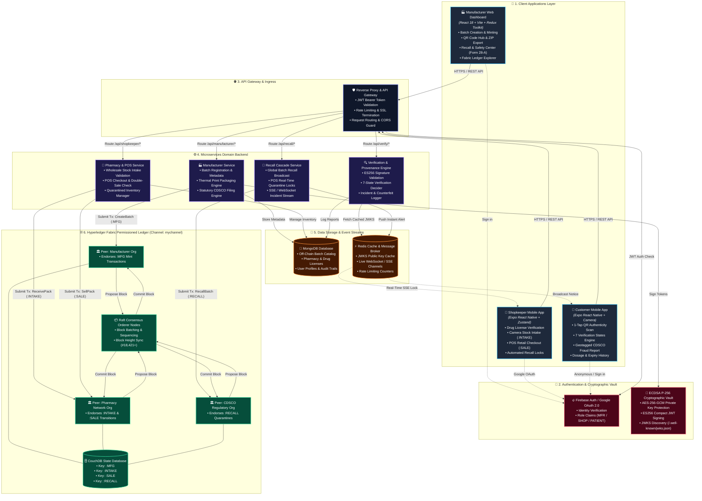
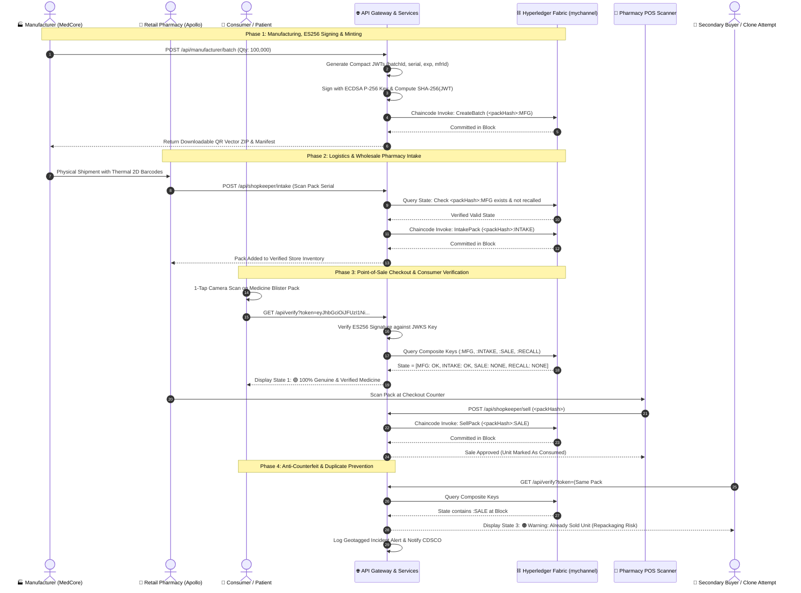
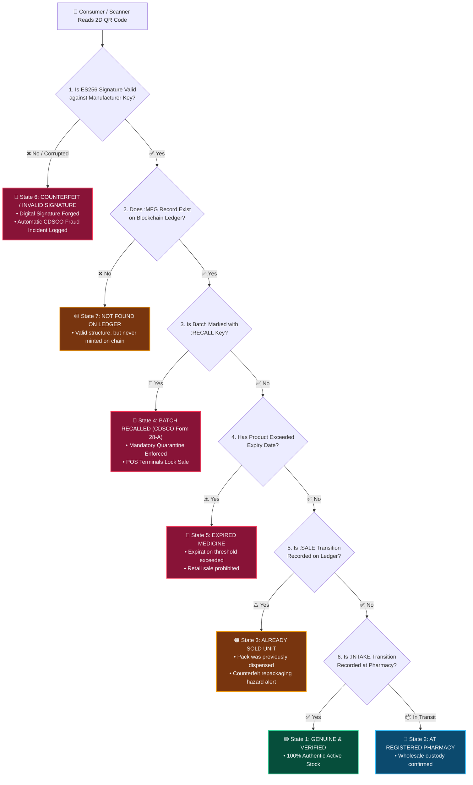

# 💊 MediaCare (PharmaChain)
### Enterprise End-to-End Pharmaceutical Traceability & Anti-Counterfeit Ecosystem

[](https://reactjs.org/)
[](https://www.typescriptlang.org/)
[](https://expo.dev/)
[](https://vitejs.dev/)
[](https://www.hyperledger.org/use/fabric)
[](https://tailwindcss.com/)
[](https://opensource.org/licenses/MIT)

---

## 📌 Executive Summary

**MediaCare (PharmaChain)** is a production-grade, zero-trust pharmaceutical supply chain tracking and medicine authenticity platform designed to eliminate counterfeit drugs from the healthcare ecosystem. 

By unifying **ECDSA P-256 (`ES256`) cryptographic signatures**, **Hyperledger Fabric permissioned blockchain ledger**, and **high-density serialized 2D QR codes**, MediaCare establishes an unbroken, tamper-evident chain of custody from primary manufacturing lines to patient consumption.

---

## 🏛️ Comprehensive System Architecture



---

## 🔄 End-to-End Medicine Provenance Lifecycle



---

## 🎯 7 Consumer Verification Decision Matrix



---

## 🏗️ Project Structure & Monorepo Layout

```text
MediaCare/
├── Manufacture-DashBoard/     # Enterprise Web Portal for Pharmaceutical Manufacturers
│   ├── src/
│   │   ├── components/        # Layout, StatusBadge, StatCard, DataTable, Modals
│   │   ├── features/dashboard/# 4-Layer Feature Architecture
│   │   │   ├── components/    # Header, Stats, Charts, Table, Safety, Operations
│   │   │   ├── Hooks/         # useDashboard() Custom Hook
│   │   │   ├── service/       # dashboard.api.ts (Pure Axios HTTP Calls)
│   │   │   └── slice/         # dashboard.slice.ts (Pure Synchronous Reducers)
│   │   ├── styles/            # Dual-Token Engine (tokens.scss & index.scss)
│   │   ├── store.ts           # Centralized Redux Store
│   │   └── App.tsx            # Main Orchestrator, Deep Linking & Theme Boot
│   ├── .env.example           # Frontend Environment Template
│   └── README.md              # Backend Developer API Specification Guide
│
├── shopkeeper-mobile/         # Retail Pharmacy Mobile App for Intake & Point-of-Sale (POS)
│   ├── src/
│   │   ├── services/api/      # client.ts, auth.ts, scan.ts, transactions.ts
│   │   ├── services/firebase/ # config.ts (Firebase Auth & Google Sign-In)
│   │   ├── store/             # authStore.ts, inventoryStore.ts
│   │   └── components/        # Barcode Scanner, POS Cart, Recall Banners
│   ├── app/                   # Expo Router File-Based Routing
│   └── .env.example           # Mobile Environment Template
│
├── customer-mobile/           # Consumer Mobile App for Instant Medicine Authenticity Scans
│   ├── src/
│   │   ├── config/            # firebase.ts (Consumes EXPO_PUBLIC_* env vars)
│   │   ├── services/api/      # client.ts (Sync, Verification, Fraud Reports)
│   │   └── store/             # authStore.ts, customerStore.ts, reportStore.ts
│   ├── app/                   # Expo Router Screens (scan, verification, reports)
│   └── .env.example           # Consumer App Environment Template
│
└── README.md                  # Master System Architecture Documentation
```

---

## ⚡ Tech Stack Matrix

| Layer | Manufacturer Dashboard | Shopkeeper Mobile | Customer Mobile |
|---|---|---|---|
| **Framework** | React 18 + Vite | Expo SDK 52 (React Native) | Expo SDK 52 (React Native) |
| **Language** | TypeScript 5.7 | TypeScript 5.7 | TypeScript 5.7 |
| **State Management** | Redux Toolkit 2.x | Zustand 5.x | Zustand 5.x |
| **Styling** | Tailwind CSS + SCSS Tokens | NativeWind / Tailwind CSS | StyleSheet + Lucide Native |
| **Sensors & Hardware**| Thermal Print Canvas Engine | Barcode / QR Camera Scanner | High-Speed QR Camera Scanner |
| **Cryptography** | ECDSA P-256 / SHA-256 | JWT & SHA-256 Verification | JWT & Offline Key Signature QA |
| **Security Vault** | AES-256-GCM Token Keystore | Expo SecureStore | Expo SecureStore |

---

## 🚀 Quick Start Guide

### Prerequisites
* **Node.js**: `v20.x` or higher
* **npm**: `v10.x` or higher
* **Expo Go App**: (Optional for physical iOS / Android device testing)

---

### 1. Manufacturer Web Dashboard

```bash
# Navigate to manufacturer portal
cd Manufacture-DashBoard

# Install dependencies
npm install

# Setup environment variables
cp .env.example .env

# Launch local development server
npm run dev
# Dashboard opens on http://localhost:5173

# Validate TypeScript & Production Build
npm run build
```

---

### 2. Shopkeeper Mobile App

```bash
# Navigate to shopkeeper mobile project
cd shopkeeper-mobile

# Install dependencies
npm install

# Setup environment variables
cp .env.example .env

# Start Expo development server
npx expo start -c
```
* Scan the QR code with **Expo Go** (Android) or **Camera** (iOS).

---

### 3. Customer Mobile App

```bash
# Navigate to customer mobile project
cd customer-mobile

# Install dependencies
npm install

# Setup environment variables
cp .env.example .env

# Start Expo development server
npx expo start -c
```

---

## 🔑 Environment Configuration

Every application strictly separates environment variables and uses `.env.example` templates:

### `Manufacture-DashBoard/.env.example`
```env
VITE_API_URL=/api/manufacturer
VITE_MANUFACTURER_ID=MFR_MEDCORE_001
VITE_FABRIC_CHANNEL=mychannel
VITE_CHAINCODE_NAME=pharmacc:v2.5
```

### `shopkeeper-mobile/.env.example`
```env
EXPO_PUBLIC_API_URL=
EXPO_PUBLIC_FIREBASE_API_KEY=
EXPO_PUBLIC_FIREBASE_AUTH_DOMAIN=
EXPO_PUBLIC_FIREBASE_PROJECT_ID=
EXPO_PUBLIC_FIREBASE_STORAGE_BUCKET=
EXPO_PUBLIC_FIREBASE_MESSAGING_SENDER_ID=
EXPO_PUBLIC_FIREBASE_APP_ID=
EXPO_PUBLIC_FIREBASE_MEASUREMENT_ID=
```

### `customer-mobile/.env.example`
```env
EXPO_PUBLIC_API_URL=
EXPO_PUBLIC_FIREBASE_API_KEY=
EXPO_PUBLIC_FIREBASE_AUTH_DOMAIN=
EXPO_PUBLIC_FIREBASE_PROJECT_ID=
EXPO_PUBLIC_FIREBASE_STORAGE_BUCKET=
EXPO_PUBLIC_FIREBASE_MESSAGING_SENDER_ID=
EXPO_PUBLIC_FIREBASE_APP_ID=
EXPO_PUBLIC_FIREBASE_MEASUREMENT_ID=
```

---

## 🏛️ Regulatory & Standards Compliance

* **CDSCO (Central Drugs Standard Control Organization)**: Fully formatted for statutory Form 28-D manufacturing licenses and Form 28-A batch recall declarations.
* **WHO-GMP (Good Manufacturing Practices)**: End-to-end serialized thermal label tracking and batch lineage logs.
* **US FDA 21 CFR Part 11 Equivalent**: Immutable electronic signatures, append-only transaction logs, and cryptographically signed audit trails.
* **GS1 Digital Link Compliant**: Standardized 2D matrix barcode format for secondary pharmaceutical cartons and blister packaging.

---

## 👥 Contributors & Hackathon Team

* **Project**: MediaCare (PharmaChain)
* **Team**: Himanshu & Team
* **Repository**: [Himanshu-05-dev/PharmaChain-frontend](https://github.com/Himanshu-05-dev/PharmaChain-frontend)

---

## 📄 License

This project is licensed under the **MIT License** — see the [LICENSE](LICENSE) file for details.
